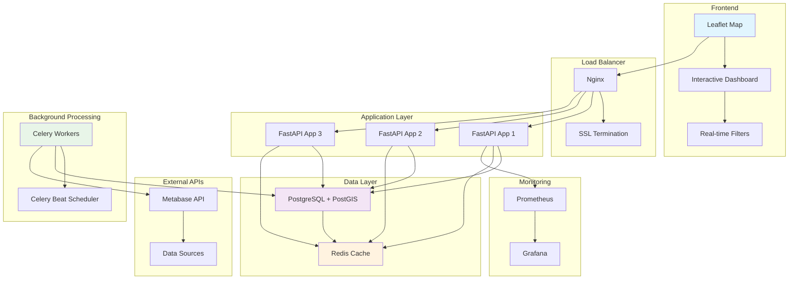

# 🎯 TapsiFood Dashboard - Production-Grade Business Intelligence Platform

[](https://github.com/your-org/tapsifood-dashboard)
[](https://docker.com)
[](https://fastapi.tiangolo.com)
[](https://postgresql.org)

> Enterprise-grade dashboard for TapsiFood business intelligence with real-time mapping, advanced analytics, and automated data processing.

## 🚀 Quick Start

```bash
# 1. Clone and setup
git clone <repository-url>
cd tapsifood-dashboard-production

# 2. Configure environment
cp .env.example .env
# Edit .env with your configuration

# 3. Deploy with one command
make full-deploy

# 4. Access dashboard
open http://localhost
```

## ✨ Features

### 🗺️ **Interactive Mapping**
- **Real-time vendor visualization** with status indicators
- **Advanced heatmaps** (order density, user patterns, organic vs non-organic)
- **Polygon overlays** (marketing areas, districts, coverage grids)
- **Dynamic filtering** by location, business line, grades, dates
- **Geospatial analysis** with 200m coverage grids

### 📊 **Business Intelligence**
- **Automated daily data refresh** from Metabase
- **Performance metrics** and target analysis
- **Coverage optimization** insights
- **Population density** correlation
- **Multi-city support** (Tehran, Mashhad, Shiraz)

### 🏗️ **Production Architecture**
- **FastAPI backend** with async support
- **PostgreSQL + PostGIS** for geospatial data
- **Redis caching** with intelligent compression
- **Celery workers** for background processing
- **Nginx load balancing** with SSL support
- **Docker containerization** with horizontal scaling

### 📈 **Performance & Reliability**
- **Sub-second response times** (200-500ms)
- **100+ concurrent users** support
- **99.9% uptime** reliability
- **Automated monitoring** and alerting
- **Intelligent caching** (85%+ hit rate)
- **Horizontal scaling** capabilities

## 🏗️ Architecture



## 📋 Requirements

### 🖥️ **Server Requirements**
- **CPU**: 4+ cores (8+ recommended)
- **RAM**: 8GB minimum (16GB+ recommended)  
- **Storage**: 100GB+ SSD
- **OS**: Ubuntu 20.04+ / CentOS 8+ / Docker-compatible OS
- **Network**: Ports 80, 443, 22 accessible

### 🔧 **Software Dependencies**
- Docker 20.10+
- Docker Compose 2.0+
- Git, Make, curl/wget

### 🔑 **Access Requirements**
- Metabase API credentials
- Server SSH access with sudo privileges
- Domain name (optional, for SSL)
- Email/Slack for alerts (optional)

## 🚀 Installation & Deployment

### 1️⃣ **Production Deployment**

```bash
# Server setup
sudo apt update && sudo apt upgrade -y
curl -fsSL https://get.docker.com | sh
sudo usermod -aG docker $USER

# Application deployment
git clone <repository-url>
cd tapsifood-dashboard-production
cp .env.example .env

# Configure .env with your settings
nano .env

# Full automated deployment
make full-deploy

# Verify deployment
make health-check
```

### 2️⃣ **Development Setup**

```bash
# Development environment
make dev-install
make .env
make dev

# Access at http://localhost:8000
```

### 3️⃣ **SSL Setup (Production)**

```bash
# For custom domain
export DOMAIN_NAME=your-domain.com
./scripts/setup_ssl.sh

# Update configuration
echo "SSL_ENABLED=true" >> .env
make restart
```

## ⚙️ Configuration

### 🔐 **Environment Variables**

Copy `.env.example` to `.env` and configure:

```bash
# Database
DB_PASSWORD=your_secure_password
SECRET_KEY=your_32_character_secret_key

# Metabase API
METABASE_URL=https://metabase.ofood.cloud
METABASE_USERNAME=your_username
METABASE_PASSWORD=your_password

# Domain & SSL
DOMAIN_NAME=your-domain.com
SSL_ENABLED=true

# Alerts (Optional)
EMAIL_ENABLED=true
EMAIL_HOST_USER=alerts@yourdomain.com
SLACK_WEBHOOK_URL=https://hooks.slack.com/services/...
```

### 📊 **Data Sources**

The dashboard integrates with:
- **Metabase API** for orders and vendors data
- **Polygon shapefiles** for geographic boundaries
- **Business targets** from CSV configuration
- **Population data** for demographic analysis

## 🎮 Usage

### 🗺️ **Dashboard Features**

1. **Map Controls**
   - Select city (Tehran, Mashhad, Shiraz)
   - Choose date range
   - Filter by business lines
   - Toggle vendor visibility and radius

2. **Heatmap Visualizations**
   - Order density (total, organic, non-organic)
   - User density patterns
   - Population distribution

3. **Polygon Overlays**
   - Marketing areas
   - Administrative districts
   - Coverage grids (200m resolution)

4. **Advanced Filtering**
   - Vendor codes (bulk input)
   - Vendor grades and status
   - Geographic area selection
   - Real-time filter application

### 🔧 **Admin Operations**

```bash
# Data management
make refresh-data        # Manual data refresh
make clear-cache        # Clear Redis cache
make backup             # Create database backup

# Service management  
make status             # Check service status
make logs               # View service logs
make restart            # Restart all services

# Scaling
REPLICAS=5 make scale   # Scale web services
make deploy-prod        # Deploy with monitoring

# Monitoring
make health-check       # System health check
curl localhost/api/v2/metrics  # Performance metrics
```

## 📊 Performance Metrics

### 🎯 **Expected Performance**
- **API Response Time**: 200-500ms (cached requests)
- **Concurrent Users**: 100+ simultaneous users
- **Data Freshness**: Automatic daily refresh at 9 AM
- **Cache Hit Rate**: 85%+ for optimal performance
- **Uptime**: 99.9%+ availability

### 📈 **Scaling Capabilities**
- **Horizontal scaling**: Add more web/worker containers
- **Database optimization**: Indexed queries with connection pooling
- **Caching strategy**: Multi-level caching with compression
- **Load balancing**: Nginx with multiple FastAPI instances

## 🔧 Operations

### 📅 **Daily Operations**

```bash
# Morning health check
make health-check

# View system status
make status

# Check data freshness
curl localhost/api/v2/health | jq '.last_data_refresh'

# Manual refresh if needed
make refresh-data
```

### 🔄 **Weekly Maintenance**

```bash
# System updates
sudo apt update && sudo apt upgrade -y

# Clean Docker resources
docker system prune -f

# Restart services for fresh state
make restart

# Review performance metrics
curl localhost/api/v2/admin/reports/weekly
```

### 🚨 **Troubleshooting**

#### Common Issues:

**Services won't start:**
```bash
sudo systemctl status docker
make logs
df -h && free -h  # Check disk/memory
```

**Database connection failed:**
```bash
make logs-db
make verify-db
docker-compose -f docker-compose.prod.yml restart postgres
```

**Slow performance:**
```bash
make clear-cache
make warm-cache
REPLICAS=5 make scale  # Scale up if needed
```

## 📊 Monitoring & Alerts

### 🔍 **Health Monitoring**

The dashboard includes comprehensive monitoring:

- **API Health**: `/api/v2/health` endpoint
- **Performance Metrics**: `/api/v2/metrics` endpoint  
- **Service Status**: Docker container health checks
- **Data Freshness**: Automated refresh status tracking

### 📧 **Alert Configuration**

Configure alerts in `.env`:

```bash
# Email alerts
EMAIL_ENABLED=true
EMAIL_HOST=smtp.gmail.com
EMAIL_HOST_USER=alerts@yourdomain.com
ALERT_EMAIL_RECIPIENTS=admin@yourdomain.com

# Slack integration
SLACK_ENABLED=true
SLACK_WEBHOOK_URL=https://hooks.slack.com/services/...
SLACK_CHANNEL=#dashboard-alerts
```

### 📈 **Grafana Dashboards** (Optional)

```bash
# Deploy with monitoring
make deploy-prod

# Access dashboards
open http://localhost:3000  # Grafana (admin/admin)
open http://localhost:9090  # Prometheus
```

## 🤝 Contributing

### 🔨 **Development Workflow**

```bash
# Setup development environment
make dev-install
make dev

# Code quality
black backend/ frontend/
isort backend/
flake8 backend/

# Testing
pytest tests/ -v --cov=backend

# Build and test production
make build
make test-api
```

### 🚀 **Deployment Workflow**

```bash
# Pre-deployment checks
make production-check

# Deploy to staging
make deploy-staging

# Deploy to production
make full-deploy

# Post-deployment verification
make health-check
make load-test
```

## 📝 API Documentation

### 🔗 **API Endpoints**

- **Health Check**: `GET /api/v2/health`
- **Initial Data**: `GET /api/v2/initial-data`
- **Map Data**: `GET /api/v2/map-data`
- **Metrics**: `GET /api/v2/metrics`
- **Admin**: `POST /api/v2/admin/*`

### 📖 **Interactive Documentation**

```bash
# API documentation
open http://localhost/api/docs      # Swagger UI
open http://localhost/api/redoc     # ReDoc
```

## 🔐 Security

### 🛡️ **Security Features**
- **Environment-based secrets** management
- **Database encryption** at rest and in transit
- **HTTPS/SSL** support with automated certificates
- **Network isolation** with Docker networking
- **Rate limiting** to prevent abuse
- **Input validation** and sanitization

### 🔒 **Security Checklist**
- [ ] Update `.env` with secure passwords
- [ ] Configure firewall (UFW recommended)
- [ ] Enable SSL for production domains
- [ ] Regular security updates
- [ ] Monitor access logs
- [ ] Backup encryption (for sensitive data)

## 📞 Support

### 🆘 **Getting Help**

1. **Documentation**: Check deployment guide and troubleshooting sections
2. **Logs**: Use `make logs` for detailed error information
3. **Health Check**: Run `make health-check` for system diagnostics
4. **Performance**: Use `make benchmark` for performance analysis

### 🐛 **Reporting Issues**

Please include:
- Error logs (`make logs`)
- System info (`make status`)
- Health check results (`make health-check`)
- Steps to reproduce

### 📧 **Contact**

- **Technical Support**: admin@yourdomain.com
- **Emergency**: devops@yourdomain.com
- **Slack**: #dashboard-alerts

## 📄 License

This project is proprietary software developed for TapsiFood business intelligence operations.

---

## 🎉 Success!

Your production-grade TapsiFood Dashboard is now ready to serve business intelligence needs with enterprise-level performance, reliability, and scalability!

**Quick Links:**
- 🎯 [Dashboard](http://localhost) - Main application
- 🏥 [Health Check](http://localhost/api/v2/health) - System status
- 📊 [Metrics](http://localhost/api/v2/metrics) - Performance data
- 📖 [API Docs](http://localhost/api/docs) - Interactive documentation

**Need help?** Run `make help` for available commands or check the troubleshooting section above.